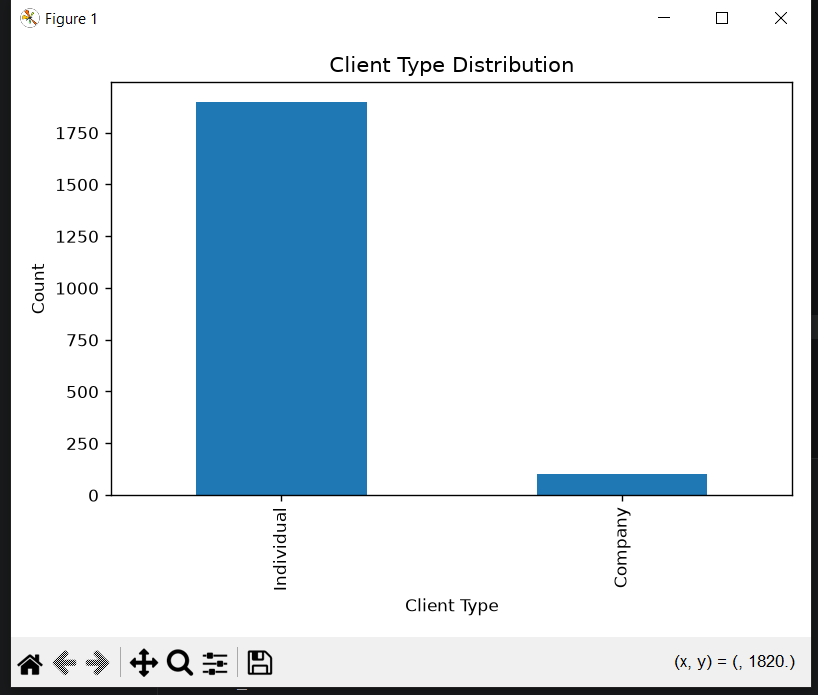

# Buyer Segmentation Project

## Project Overview

This project analyzes real estate buyer data and uses K-Means Clustering to segment customers based on their characteristics and purchasing behavior.

## Technologies Used

* Python
* Pandas
* NumPy
* Matplotlib
* Seaborn
* Scikit-Learn

## Dataset

The project uses two datasets:

* clients.csv
* properties.csv

## Project Workflow

1. Data Loading
2. Data Cleaning
3. Data Preprocessing
4. Feature Engineering
5. Data Visualization
6. K-Means Clustering
7. Customer Segmentation

## Features Used for Clustering

* Age
* Sale Price
* Floor Area (sqft)
* Satisfaction Score

## Cluster Summary

| Cluster   | Description              |
| --------- | ------------------------ |
| Cluster 0 | Low Satisfaction Buyers  |
| Cluster 1 | Highly Satisfied Buyers  |
| Cluster 2 | Premium Property Buyers  |
| Cluster 3 | Younger Mid-Range Buyers |

## Visualizations

### Elbow Method

### Country Distribution

### Buyer Segments

### Pie Chart

### Buyer Segment 2

### Capture

## Results

The K-Means model successfully identified four distinct buyer segments that can be used for targeted marketing and customer analysis.

## Author

Sri Priya Prakash
